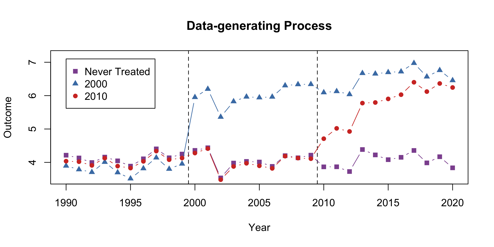
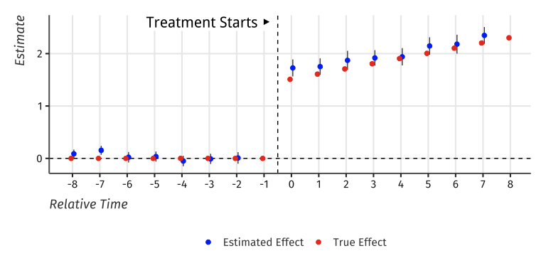
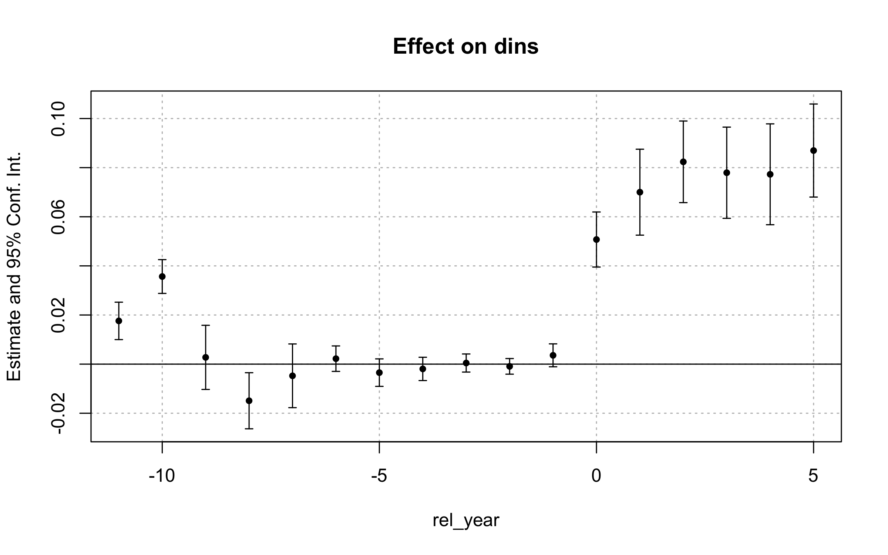
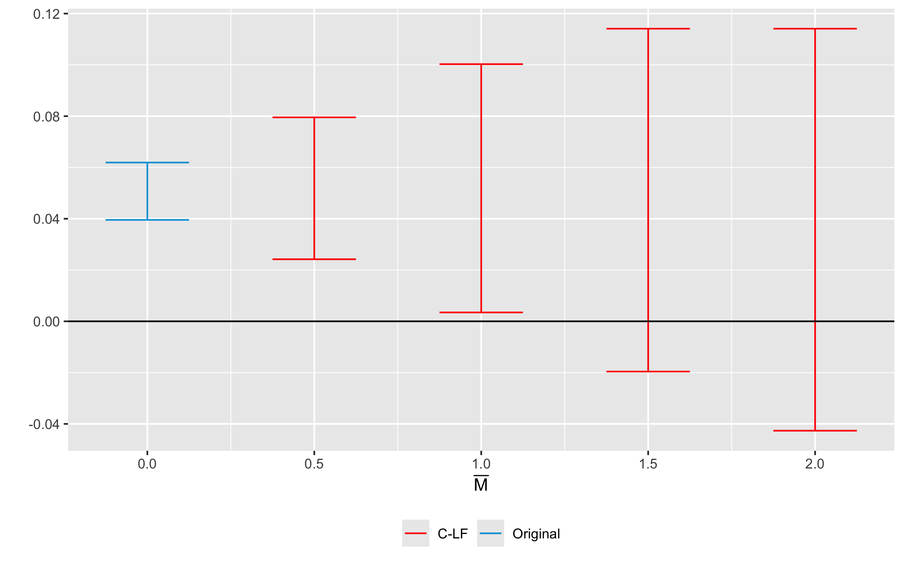
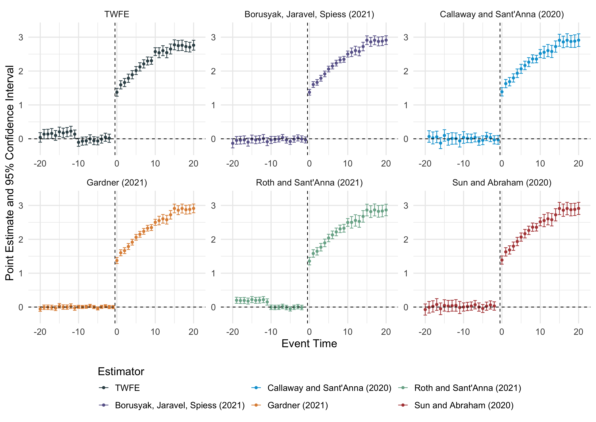

<!-- README.md is generated from README.Rmd. Please edit that file -->

# did2s

<!-- badges: start -->
<!-- badges: end -->

The goal of did2s is to estimate TWFE models without running into the
problem of staggered treatment adoption.

For common issues, see this issue:
<https://github.com/kylebutts/did2s/issues/12>

## Installation

You can install did2s from CRAN with:

``` r
install.packages("did2s")
```

To install the development version, run the following:

``` r
devtools::install_github("kylebutts/did2s")
```

## Two-stage Difference-in-differences (Gardner 2021)

For details on the methodology, view this
[vignette](https://kylebutts.github.io/did2s/articles/Two-Stage-Difference-in-Differences.html)

To view the documentation, type `?did2s` into the console.

The main function is `did2s` which estimates the two-stage did
procedure. This function requires the following options:

- `yname`: the outcome variable
- `first_stage`: formula for first stage, can include fixed effects and
  covariates, but do not include treatment variable(s)!
- `second_stage`: This should be the treatment variable or in the case
  of event studies, treatment variables.
- `treatment`: This has to be the 0/1 treatment variable that marks when
  treatment turns on for a unit. If you suspect anticipation, see note
  above for accounting for this.
- `cluster_var`: Which variables to cluster on

Optional options:

- `weights`: Optional variable to run a weighted first- and second-stage
  regressions
- `bootstrap`: Should standard errors be bootstrapped instead? Default
  is False.
- `n_bootstraps`: How many clustered bootstraps to perform for standard
  errors. Default is 250.

did2s returns a list with two objects:

1.  fixest estimate for the second stage with corrected standard errors.

### TWFE vs. Two-Stage DID Example

I will load example data from the package and plot the average outcome
among the groups.

``` r
# Automatically loads fixest
library(did2s)
#> Loading required package: fixest
#> did2s (v1.1.0). For more information on the methodology, visit <https://www.kylebutts.github.io/did2s>
#> 
#> To cite did2s in publications use:
#> 
#>   Butts & Gardner, "The R Journal: did2s: Two-Stage
#>   Difference-in-Differences", The R Journal, 2022
#> 
#> A BibTeX entry for LaTeX users is
#> 
#>   @Manual{,
#>     title = {did2s: Two-Stage Difference-in-Differences Following Gardner (2021)},
#>     author = {Kyle Butts and John Gardner},
#>     year = {2021},
#>     url = {https://journal.r-project.org/articles/RJ-2022-048/},
#>   }

# Load Data from R package
data("df_het", package = "did2s")
df_het = as.data.frame(df_het)
```

Here is a plot of the average outcome variable for each of the groups:

``` r
# Mean for treatment group-year
agg <- aggregate(df_het$dep_var, by = list(g = df_het$g, year = df_het$year), FUN = mean)

agg$g <- as.character(agg$g)
agg$g <- ifelse(agg$g == "0", "Never Treated", agg$g)

never <- agg[agg$g == "Never Treated", ]
g1 <- agg[agg$g == "2000", ]
g2 <- agg[agg$g == "2010", ]


plot(0, 0,
  xlim = c(1990, 2020), ylim = c(3.5, 7.2), type = "n",
  main = "Data-generating Process", ylab = "Outcome", xlab = "Year"
)
abline(v = c(1999.5, 2009.5), lty = 2)
lines(never$year, never$x, col = "#8e549f", type = "b", pch = 15)
lines(g1$year, g1$x, col = "#497eb3", type = "b", pch = 17)
lines(g2$year, g2$x, col = "#d2382c", type = "b", pch = 16)
legend(
  x = 1990, y = 7.1, col = c("#8e549f", "#497eb3", "#d2382c"),
  pch = c(15, 17, 16),
  legend = c("Never Treated", "2000", "2010")
)
```

<div class="figure">


<p class="caption">
Example data with heterogeneous treatment effects
</p>

</div>

### Estimate Two-stage Difference-in-Differences

First, lets estimate a static did. There are two things to note here.
First, note that I can use `fixest::feols` formula including the `|` for
specifying fixed effects and `fixest::i` for improved factor variable
support. Second, note that `did2s` returns a `fixest` estimate object,
so `fixest::etable`, `fixest::coefplot`, and `fixest::iplot` all work as
expected.

``` r
# Static
static <- did2s(
  df_het,
  yname = "dep_var", first_stage = ~ 0 | state + year,
  second_stage = ~ i(treat, ref = FALSE), treatment = "treat",
  cluster_var = "state"
)
#> Running Two-stage Difference-in-Differences
#>  - first stage formula `~ 0 | state + year`
#>  - second stage formula `~ i(treat, ref = FALSE)`
#>  - The indicator variable that denotes when treatment is on is `treat`
#>  - Standard errors will be clustered by `state`

fixest::etable(static)
#>                            static
#> Dependent Var.:           dep_var
#>                                  
#> treat = TRUE    2.152*** (0.0476)
#> _______________ _________________
#> S.E. type                  Custom
#> Observations               46,500
#> R2                        0.33790
#> Adj. R2                   0.33790
#> ---
#> Signif. codes: 0 '***' 0.001 '**' 0.01 '*' 0.05 '.' 0.1 ' ' 1
```

This is very close to the true treatment effect of ~2.23.

Then, let’s estimate an event study did. Note that relative year has a
value of `Inf` for never treated, so I put this as a reference in the
second stage formula.

``` r
# Event Study
es <- did2s(df_het,
  yname = "dep_var", first_stage = ~ 0 | state + year,
  second_stage = ~ i(rel_year, ref = c(-1, Inf)), treatment = "treat",
  cluster_var = "state"
)
#> Running Two-stage Difference-in-Differences
#>  - first stage formula `~ 0 | state + year`
#>  - second stage formula `~ i(rel_year, ref = c(-1, Inf))`
#>  - The indicator variable that denotes when treatment is on is `treat`
#>  - Standard errors will be clustered by `state`
```

And plot the results:

``` r
fixest::iplot(es, main = "Event study: Staggered treatment", xlab = "Relative time to treatment", col = "steelblue", ref.line = -0.5)

# Add the (mean) true effects
true_effects <- head(tapply((df_het$te + df_het$te_dynamic), df_het$rel_year, mean), -1)
points(-20:20, true_effects, pch = 20, col = "black")

# Legend
legend(
  x = -20, y = 3, col = c("steelblue", "black"), pch = c(20, 20),
  legend = c("Two-stage estimate", "True effect")
)
```

<div class="figure">


<p class="caption">
Event-study plot with example data
</p>

</div>

### Comparison to TWFE

``` r
twfe <- feols(dep_var ~ i(rel_year, ref = c(-1, Inf)) | unit + year, data = df_het)

fixest::iplot(list(es, twfe),
  sep = 0.2, ref.line = -0.5,
  col = c("steelblue", "#82b446"), pt.pch = c(20, 18),
  xlab = "Relative time to treatment",
  main = "Event study: Staggered treatment (comparison)"
)


# Legend
legend(
  x = -20, y = 3, col = c("steelblue", "#82b446"), pch = c(20, 18),
  legend = c("Two-stage estimate", "TWFE")
)
```


### Honest DID

In version 1.1.0, we added support for computing a sensitivity analysis
using the approach of Rambachan and Roth (2021).

Here’s an example using data from
[here](https://github.com/Mixtape-Sessions/Advanced-DID/tree/main/Exercises/Exercise-1).
The provided dataset `ehec_data.dta` contains a state-level panel
dataset on health insurance coverage and Medicaid expansion. The
variable `dins` shows the share of low-income childless adults with
health insurance in the state. The variable `yexp2` gives the year that
a state expanded Medicaid coverage under the Affordable Care Act, and is
missing if the state never expanded.

``` r
library(HonestDiD)
library(ggplot2)

df <- haven::read_dta("https://raw.githubusercontent.com/Mixtape-Sessions/Advanced-DID/main/Exercises/Data/ehec_data.dta")

df$treated <- ifelse(is.na(df$yexp2), 0, 1 * (df$year >= df$yexp2))
df$rel_year <- ifelse(is.na(df$yexp2), -100, df$year - df$yexp2)

# Estimate did2s
es_did2s <- did2s(
  df,
  yname = "dins",
  first_stage = ~ 0 | stfips + year,
  second_stage = ~ 0 + i(rel_year, ref = -100),
  treatment = "treated",
  cluster_var = "stfips"
)
#> Running Two-stage Difference-in-Differences
#>  - first stage formula `~ 0 | stfips + year`
#>  - second stage formula `~ 0 + i(rel_year, ref = -100)`
#>  - The indicator variable that denotes when treatment is on is `treated`
#>  - Standard errors will be clustered by `stfips`

coefplot(es_did2s)
```

<div class="figure">


<p class="caption">
Estimates of the effect of Medicaid expansion on health insurance
coverage
</p>

</div>

``` r
# Relative Magnitude sensitivity analysis
sensitivity_results <- es_did2s |> 
  # Take fixest obj and convert for `honest_did_did2s`
  get_honestdid_obj_did2s(coef_name = "rel_year") |>
  # Run sensitivity analysis
  honest_did_did2s(
    e = 0,
    type = "relative_magnitude",
    Mbarvec = seq(from = 0.5, to = 2, by = 0.5)
  )
#> Warning in .ARP_computeCI(betahat = betahat, sigma = sigma, numPrePeriods =
#> numPrePeriods, : CI is open at one of the endpoints; CI length may not be
#> accurate

#> Warning in .ARP_computeCI(betahat = betahat, sigma = sigma, numPrePeriods =
#> numPrePeriods, : CI is open at one of the endpoints; CI length may not be
#> accurate

#> Warning in .ARP_computeCI(betahat = betahat, sigma = sigma, numPrePeriods =
#> numPrePeriods, : CI is open at one of the endpoints; CI length may not be
#> accurate

# Create plot
HonestDiD::createSensitivityPlot_relativeMagnitudes(
  sensitivity_results$robust_ci,
  sensitivity_results$orig_ci
)
```

<div class="figure">


<p class="caption">
Sensitivity analysis for the example data
</p>

</div>

## Event-study plot

``` r
library(tidyverse)
#> ── Attaching core tidyverse packages ──────────────────────── tidyverse 2.0.0 ──
#> ✔ dplyr     1.1.4     ✔ readr     2.1.5
#> ✔ forcats   1.0.0     ✔ stringr   1.5.1
#> ✔ lubridate 1.9.3     ✔ tibble    3.2.1
#> ✔ purrr     1.0.2     ✔ tidyr     1.3.1
#> ── Conflicts ────────────────────────────────────────── tidyverse_conflicts() ──
#> ✖ dplyr::filter() masks stats::filter()
#> ✖ dplyr::lag()    masks stats::lag()
#> ℹ Use the conflicted package (<http://conflicted.r-lib.org/>) to force all conflicts to become errors
data(df_het)
df = df_het
multiple_ests = did2s::event_study(
  data = df |> mutate(g = ifelse(g == Inf, NA, g)) |> as.data.frame(),
  gname = "g",
  idname = "unit",
  tname = "year",
  yname = "dep_var",
  estimator = "all"
)
#> Note these estimators rely on different underlying assumptions. See Table 2 of `https://arxiv.org/abs/2109.05913` for an overview.
#> Estimating TWFE Model
#> Estimating using Gardner (2021)
#> Estimating using Callaway and Sant'Anna (2020)
#> Estimating using Sun and Abraham (2020)
#> Estimating using Borusyak, Jaravel, Spiess (2021)
#> Estimating using Roth and Sant'Anna (2021)
did2s::plot_event_study(multiple_ests)
```



# Citation

If you use this package to produce scientific or commercial
publications, please cite according to:

``` r
citation(package = "did2s")
#> To cite did2s in publications use:
#> 
#>   Butts & Gardner, "The R Journal: did2s: Two-Stage
#>   Difference-in-Differences", The R Journal, 2022
#> 
#> A BibTeX entry for LaTeX users is
#> 
#>   @Manual{,
#>     title = {did2s: Two-Stage Difference-in-Differences Following Gardner (2021)},
#>     author = {Kyle Butts and John Gardner},
#>     year = {2021},
#>     url = {https://journal.r-project.org/articles/RJ-2022-048/},
#>   }
```

# References

<div id="refs" class="references csl-bib-body hanging-indent">

<div id="ref-Gardner_2021" class="csl-entry">

Gardner, John. 2021. “<span class="nocase">Two-Stage
Difference-in-Differences</span>.” Working Paper.
<https://jrgcmu.github.io/2sdd_current.pdf>.

</div>

</div>
