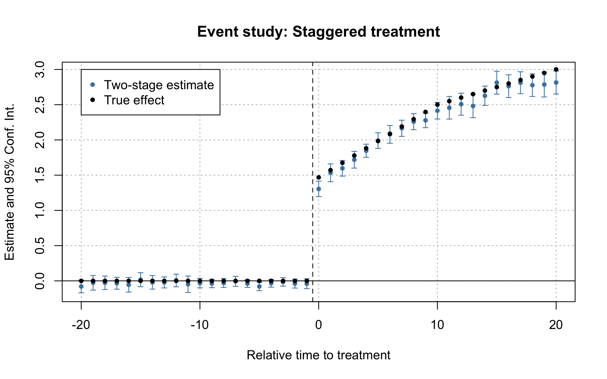
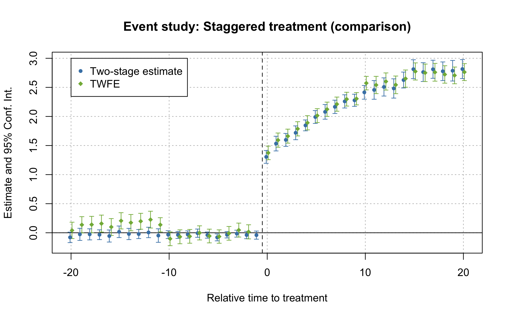

<!-- README.md is generated from README.Rmd. Please edit that file -->

# did2s

<!-- badges: start -->
<!-- badges: end -->

The goal of did2s is to estimate TWFE models without running into the
problem of staggered treatment adoption.

## Installation

You can install did2s from github with:

``` r
devtools::install_github("kylebutts/did2s")
```

## Two-stage Difference-in-differences (Gardner 2021)

For details on the methodology, view this
[vignette](http://kylebutts.com/did2s/articles/Two-Stage-Difference-in-Differences.html)

I have created an R package with the help of John Gardner to estimate
the two-stage difference-in-differences estimator. To install the
package, run the following:

``` r
devtools::install_github("kylebutts/did2s")
```

To view the documentation, type `?did2s` into the console.

The main function is `did2s` which estimates the two-stage did
procedure. This function requires the following options:

-   `yname`: the outcome variable
-   `first_stage`: formula for first stage, can include fixed effects
    and covariates, but do not include treatment variable(s)!
-   `second_stage`: This should be the treatment variable or in the case
    of event studies, treatment variables.
-   `treatment`: This has to be the 0/1 treatment variable that marks
    when treatment turns on for a unit. If you suspect anticipation, see
    note above for accounting for this.
-   `cluster_var`: Which variables to cluster on

Optional options:

-   `weights`: Optional variable to run a weighted first- and
    second-stage regressions
-   `bootstrap`: Should standard errors be bootstrapped instead? Default
    is False.
-   `n_bootstraps`: How many clustered bootstraps to perform for
    standard errors. Default is 250.

did2s returns a fixest estimate for the second stage with corrected standard errors.

### TWFE vs. Two-Stage DID Example

I will load example data from the package and plot the average outcome
among the groups. Here is one unit’s data:

``` r
library(tidyverse)
#> ── Attaching packages ─────────────────────────────────────── tidyverse 1.3.1 ──
#> ✓ ggplot2 3.3.3     ✓ purrr   0.3.4
#> ✓ tibble  3.1.2     ✓ dplyr   1.0.7
#> ✓ tidyr   1.1.3     ✓ stringr 1.4.0
#> ✓ readr   1.4.0     ✓ forcats 0.5.1
#> ── Conflicts ────────────────────────────────────────── tidyverse_conflicts() ──
#> x dplyr::filter() masks stats::filter()
#> x dplyr::lag()    masks stats::lag()
library(did2s)
library(fixest)
#> fixest 0.9.0, BREAKING changes! (Permanently remove this message with fixest_startup_msg(FALSE).) 
#> - In i():
#>     + the first two arguments have been swapped! Now it's i(factor_var, continuous_var) for interactions. 
#>     + argument 'drop' has been removed (put everything in 'ref' now).
#> - In feglm(): 
#>     + the default family becomes 'gaussian' to be in line with glm(). Hence, for Poisson estimations, please use fepois() instead.
library(rmarkdown)

# Load theme
source("https://raw.githubusercontent.com/kylebutts/templates/master/ggplot_theme/theme_kyle.R")
#> Loading required package: showtext
#> Loading required package: sysfonts
#> Loading required package: showtextdb

# Load Data from R package
data("df_het")

# One observation
df_het %>% select(unit, g, year, treat, rel_year, dep_var) %>% head(n = 31) %>% pander::pander()
```

| unit |  g   | year | treat | rel\_year | dep\_var |
|:----:|:----:|:----:|:-----:|:---------:|:--------:|
|  1   | 2000 | 1990 | FALSE |    -10    |  4.738   |
|  1   | 2000 | 1991 | FALSE |    -9     |  4.352   |
|  1   | 2000 | 1992 | FALSE |    -8     |  3.108   |
|  1   | 2000 | 1993 | FALSE |    -7     |  6.473   |
|  1   | 2000 | 1994 | FALSE |    -6     |   7.35   |
|  1   | 2000 | 1995 | FALSE |    -5     |   6.33   |
|  1   | 2000 | 1996 | FALSE |    -4     |  5.729   |
|  1   | 2000 | 1997 | FALSE |    -3     |  6.651   |
|  1   | 2000 | 1998 | FALSE |    -2     |  9.263   |
|  1   | 2000 | 1999 | FALSE |    -1     |  5.737   |
|  1   | 2000 | 2000 | TRUE  |     0     |  5.981   |
|  1   | 2000 | 2001 | TRUE  |     1     |  7.501   |
|  1   | 2000 | 2002 | TRUE  |     2     |  6.519   |
|  1   | 2000 | 2003 | TRUE  |     3     |  7.725   |
|  1   | 2000 | 2004 | TRUE  |     4     |  6.123   |
|  1   | 2000 | 2005 | TRUE  |     5     |  6.874   |
|  1   | 2000 | 2006 | TRUE  |     6     |  9.367   |
|  1   | 2000 | 2007 | TRUE  |     7     |  9.811   |
|  1   | 2000 | 2008 | TRUE  |     8     |  9.136   |
|  1   | 2000 | 2009 | TRUE  |     9     |  10.67   |
|  1   | 2000 | 2010 | TRUE  |    10     |  6.404   |
|  1   | 2000 | 2011 | TRUE  |    11     |   6.77   |
|  1   | 2000 | 2012 | TRUE  |    12     |  8.506   |
|  1   | 2000 | 2013 | TRUE  |    13     |  7.379   |
|  1   | 2000 | 2014 | TRUE  |    14     |  7.088   |
|  1   | 2000 | 2015 | TRUE  |    15     |  7.383   |
|  1   | 2000 | 2016 | TRUE  |    16     |  6.786   |
|  1   | 2000 | 2017 | TRUE  |    17     |  9.125   |
|  1   | 2000 | 2018 | TRUE  |    18     |  8.458   |
|  1   | 2000 | 2019 | TRUE  |    19     |  6.371   |
|  1   | 2000 | 2020 | TRUE  |    20     |  5.908   |

Here is a plot of the average outcome variable for each of the groups:

``` r
# Plot Data 
df_avg <- df_het %>% 
  group_by(group, year) %>% 
  summarize(dep_var = mean(dep_var), .groups = 'drop')

# Get treatment years for plotting
gs <- df_het %>% 
  filter(treat == TRUE) %>% 
  pull(g) %>% unique()
    
    
ggplot() + 
    geom_line(data = df_avg, mapping = aes(y = dep_var, x = year, color = group), size = 1.5) +
    geom_vline(xintercept = gs - 0.5, linetype = "dashed") + 
    theme_kyle(base_size = 16) +
    theme(legend.position = "bottom") +
    labs(y = "Outcome", x = "Year", color = "Treatment Cohort") + 
    scale_y_continuous(expand = expansion(add = .5)) + 
    scale_color_manual(values = c("Group 1" = "#d2382c", "Group 2" = "#497eb3", "Group 3" = "#8e549f")) 
```

<div class="figure">


<p class="caption">
Example data with heterogeneous treatment effects
</p>

</div>

### Estimate Two-stage Difference-in-Differences

First, lets estimate a static did:

``` r
# Static
static <- did2s(df_het, 
                yname = "dep_var", first_stage = ~i(state) + i(year), 
                second_stage = ~i(treat, ref=FALSE), treatment = "treat", 
                cluster_var = "state")
#> 
#> ── Two-stage Difference-in-Differences ─────────────────────────────────────────
#> → Running with first stage formula `~ i(state) + i(year)` and second stage formula `~ i(treat, ref = FALSE)`
#> → The indicator variable that denotes when treatment is on is `treat`
#> → Standard errors will be clustered by `state`
#> ℹ For more information on the methodology, visit <https://www.kylebutts.com/did2s>

fixest::esttable(static)
#>                            static
#> Dependent Var.:           dep_var
#>                                  
#> treat = TRUE    2.380*** (0.0614)
#> _______________ _________________
#> S.E. type                  Custom
#> Observations               31,000
#> R2                        0.28955
#> Adj. R2                   0.28955
```

This is very close to the true treatment effect of 2.2485745.

Then, let’s estimate an event study did:

``` r
# Event Study
es <- did2s(df_het,
            yname = "dep_var", first_stage = ~i(state) + i(year), 
            second_stage = ~i(rel_year, ref=c(-1, Inf)), treatment = "treat", 
            cluster_var = "state")
#> 
#> ── Two-stage Difference-in-Differences ─────────────────────────────────────────
#> → Running with first stage formula `~ i(state) + i(year)` and second stage formula `~ i(rel_year, ref = c(-1, Inf))`
#> → The indicator variable that denotes when treatment is on is `treat`
#> → Standard errors will be clustered by `state`
#> ℹ For more information on the methodology, visit <https://www.kylebutts.com/did2s>

fixest::esttable(es)
#>                                 es
#> Dependent Var.:            dep_var
#>                                   
#> rel_year = -20     0.0495 (0.0795)
#> rel_year = -19    0.1550. (0.0793)
#> rel_year = -18     0.0429 (0.0862)
#> rel_year = -17     0.0798 (0.0805)
#> rel_year = -16     0.1023 (0.0882)
#> rel_year = -15    0.2164* (0.0948)
#> rel_year = -14    0.1708* (0.0839)
#> rel_year = -13     0.0940 (0.0806)
#> rel_year = -12     0.0899 (0.0840)
#> rel_year = -11    0.1976* (0.0800)
#> rel_year = -10     0.0953 (0.0619)
#> rel_year = -9      0.0513 (0.0586)
#> rel_year = -8     0.0878* (0.0403)
#> rel_year = -7   0.1542*** (0.0440)
#> rel_year = -6      0.0221 (0.0510)
#> rel_year = -5      0.0351 (0.0490)
#> rel_year = -4     -0.0508 (0.0505)
#> rel_year = -3     -0.0094 (0.0496)
#> rel_year = -2      0.0089 (0.0565)
#> rel_year = 0     1.727*** (0.0827)
#> rel_year = 1     1.752*** (0.0798)
#> rel_year = 2     1.871*** (0.0930)
#> rel_year = 3     1.918*** (0.0755)
#> rel_year = 4     1.940*** (0.0842)
#> rel_year = 5     2.146*** (0.0847)
#> rel_year = 6     2.180*** (0.0920)
#> rel_year = 7     2.348*** (0.0818)
#> rel_year = 8     2.413*** (0.0764)
#> rel_year = 9     2.620*** (0.1075)
#> rel_year = 10    2.681*** (0.0954)
#> rel_year = 11    2.712*** (0.1204)
#> rel_year = 12    2.672*** (0.1533)
#> rel_year = 13    2.656*** (0.1225)
#> rel_year = 14    2.755*** (0.1293)
#> rel_year = 15    2.823*** (0.1341)
#> rel_year = 16    2.694*** (0.1200)
#> rel_year = 17    2.897*** (0.1266)
#> rel_year = 18    3.130*** (0.1160)
#> rel_year = 19    3.231*** (0.1235)
#> rel_year = 20    3.308*** (0.1120)
#> _______________ __________________
#> S.E. type                   Custom
#> Observations                31,000
#> R2                         0.30589
#> Adj. R2                    0.30501
```

And plot the results:

``` r
pts <- broom::tidy(es) %>%
    filter(str_detect(term, "rel_year::")) %>%
    select(rel_year = term, estimate, se = std.error) %>%
    mutate(
        rel_year = as.numeric(str_remove(rel_year, "rel_year::")),
        ci_lower = estimate - 1.96 * se,
        ci_upper = estimate + 1.96 * se,
        group = "Two-Stage Estimate"
    ) %>%
    filter(rel_year <= 8 & rel_year >= -8) %>% 
    mutate(rel_year = rel_year + 0.1)

te_true <- df_het %>%
    # Keep only treated units
    filter(g > 0) %>%
    group_by(rel_year) %>%
    summarize(estimate = mean(te + te_dynamic)) %>%
      mutate(group = "True Effect") %>%
    filter(rel_year >= -8 & rel_year <= 8) %>% 
    mutate(rel_year = rel_year)

pts <- bind_rows(pts, te_true)

max_y <- max(pts$estimate)

ggplot() +
    # 0 effect
    geom_hline(yintercept = 0, linetype = "dashed") +
    geom_vline(xintercept = -0.5, linetype = "dashed") +
    # Confidence Intervals
    geom_linerange(data = pts, mapping = aes(x = rel_year, ymin = ci_lower, ymax = ci_upper), color = "grey30") +
    # Estimates
    geom_point(data = pts, mapping = aes(x = rel_year, y = estimate, color = group), size = 2) +
    # Label
    geom_label(data = data.frame(x = -0.5 - 0.1, y = max_y + 0.25, label = "Treatment Starts ▶"), label.size=NA,
               mapping = aes(x = x, y = y, label = label), size = 5.5, hjust = 1, fontface = 2, inherit.aes = FALSE) +
    scale_x_continuous(breaks = -8:8, minor_breaks = NULL) +
    scale_y_continuous(minor_breaks = NULL) +
    scale_color_manual(values = c("Two-Stage Estimate" = "steelblue", "True Effect" = "#b44682", "TWFE Estimate" = "#82b446"))
#> Warning: Removed 17 rows containing missing values (geom_segment).
```

<div class="figure">


<p class="caption">
Event-study plot with example data
</p>

</div>

``` r
    labs(x = "Relative Time", y = "Estimate", color = NULL, title = NULL) +
    theme_kyle(base_size = 16) +
    theme(legend.position = "bottom")
#> NULL
```

### Comparison to TWFE

``` r
# TWFE
twfe <- fixest::feols(dep_var ~ i(rel_year, ref=c(-1, Inf)) | unit + year, data = df_het) %>%
    broom::tidy() %>%
    filter(str_detect(term, "rel_year::")) %>%
    select(rel_year = term, estimate, se = std.error) %>%
    mutate(
        rel_year = as.numeric(str_remove(rel_year, "rel_year::")),
        ci_lower = estimate - 1.96 * se,
        ci_upper = estimate + 1.96 * se,
        group = "TWFE Estimate"
    ) %>%
    filter(rel_year <= 8 & rel_year >= -8) %>% 
    mutate(rel_year = rel_year - 0.1)

# Add TWFE Points
both_pts <- pts %>% mutate(
        group = if_else(group == "Estimated Effect", "Two-Stage Estimate", group)
    ) %>% 
    bind_rows(., twfe)


ggplot() +
    # 0 effect
    geom_hline(yintercept = 0, linetype = "dashed") +
    geom_vline(xintercept = -0.5, linetype = "dashed") +
    # Confidence Intervals
    geom_linerange(data = both_pts, mapping = aes(x = rel_year, ymin = ci_lower, ymax = ci_upper), color = "grey30") +
    # Estimates
    geom_point(data = both_pts, mapping = aes(x = rel_year, y = estimate, color = group), size = 2) +
    # Label
    geom_label(data = data.frame(x = -0.5 - 0.1, y = max_y + 0.25, label = "Treatment Starts ▶"), label.size=NA,
               mapping = aes(x = x, y = y, label = label), size = 5.5, hjust = 1, fontface = 2, inherit.aes = FALSE) +
    scale_x_continuous(breaks = -8:8, minor_breaks = NULL) +
    scale_y_continuous(minor_breaks = NULL) +
    scale_color_manual(values = c("Two-Stage Estimate" = "steelblue", "True Effect" = "#b44682", "TWFE Estimate" = "#82b446")) +
    labs(x = "Relative Time", y = "Estimate", color = NULL, title = NULL) +
    theme_kyle(base_size = 16) +
    theme(legend.position = "bottom")
#> Warning: Removed 17 rows containing missing values (geom_segment).
```

<div class="figure">


<p class="caption">
TWFE and Two-Stage estimates of Event-Study
</p>

</div>

# References

<div id="refs" class="references csl-bib-body hanging-indent">

<div id="ref-Gardner_2021" class="csl-entry">

Gardner, John. 2021. “<span class="nocase">Two-Stage
Difference-in-Differences</span>.” Working Paper.
<https://jrgcmu.github.io/2sdd_current.pdf>.

</div>

</div>
